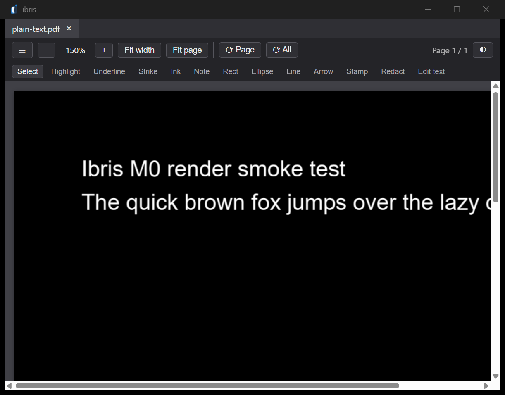

<picture>
  <source media="(prefers-color-scheme: dark)" srcset="assets/logo/logo-horizontal-dark.svg">
  
</picture>

A fast, native-feeling PDF reader and editor for Windows, built with Tauri,
React, and Rust on top of PDFium. MIT licensed.

Ibris opens documents in tabs, annotates and redacts them, fills AcroForms,
edits text in place, and writes the result without ever mutating the file you
opened. Everything that touches PDF bytes lives in Rust; the UI never sees
them.



## Status

Milestone **M6a**. The viewer and the editing pipeline are built and tested;
what remains is polish, packaging, and the known gaps listed at the bottom.

**Works today**

| Area | What you can do |
| --- | --- |
| Viewing | Multi-tab shell, tile-based rendering, zoom, fit-width / fit-page, page and whole-document rotation, dark-mode rendering of the page itself |
| Navigation | Page thumbnails, document outline, full-text search, command palette |
| Annotating | Highlight, underline, strike-through, ink, sticky notes, rectangle, ellipse, line, arrow, stamp, and image signatures |
| Forms | Fill AcroForm text fields, checkboxes, radio groups, dropdowns and list boxes; flatten on save |
| Redaction | Drag a region, review pending marks, and save a file whose text is actually gone — not covered with a black box |
| Text editing | Edit existing text in place, with the edit refused up front when the page's subset font lacks a glyph you typed |
| Pages | Insert, extract, split, merge, reorder |
| History | Undoable command stack with a history panel you can jump back through |
| Recovery | Crash-recovery sidecars, fingerprinted by file size and mtime |

**Not built yet:** printing, digital signature verification, OCR, and any
platform other than Windows.

## How redaction works

Redaction is the one feature where "looks removed" and "is removed" are
different, so it is worth stating what Ibris does. Marked regions are removed
from the content stream, and before the saved file replaces anything, it is
re-scanned: the words that were inside the redacted regions are searched for
again across page text, document metadata, outline titles, and form field
values. If any of them survive, the save is refused and the error names the
channel that leaked. The original file is left untouched.

## Prerequisites

| Tool | Install | Verify |
| --- | --- | --- |
| Rust (stable, **MSVC**) | `winget install Rustlang.Rustup` | `rustc -vV` — host must be `x86_64-pc-windows-msvc`, not `-gnu` |
| VS Build Tools 2022 + C++ workload | `winget install --id Microsoft.VisualStudio.2022.BuildTools --override "--quiet --wait --norestart --add Microsoft.VisualStudio.Workload.VCTools;includeRecommended"` | `& "C:\Program Files (x86)\Microsoft Visual Studio\Installer\vswhere.exe" -latest -products * -requires Microsoft.VisualStudio.Component.VC.Tools.x86.x64 -property installationPath` prints a path |
| Node.js LTS | `winget install OpenJS.NodeJS.LTS` | `node --version` |

The MSVC requirement is the one that bites: without the C++ Build Tools,
`cargo` compiles for a while and then fails with a confusing
``linker `link.exe` not found`` error.

## Setup

```powershell
git clone https://github.com/IbrahimAwad98/ibris.git
cd ibris
npm install
powershell -File scripts/get-pdfium.ps1   # fetches the PDFium binary — see docs/PDFIUM.md
cd src-tauri
cargo test                                 # proves the whole setup end to end
```

If `cargo test` passes, everything works. `npm run dev` from the repo root
opens the app.

`scripts/get-pdfium.ps1` pins a specific PDFium release tag (a non-V8
`bblanchon/pdfium-binaries` build). It does not verify a checksum, so it is
reproducible by tag rather than by content.

## Development

```bash
npm run dev              # Run the app in development
npm run dev:web          # Vite alone, no Tauri shell
npm run build            # Production build
npm run typecheck        # tsc --noEmit
npm run lint             # ESLint
npm test                 # Vitest (frontend)

cargo test               # Rust tests (run from src-tauri/)
cargo clippy --all-targets -- -D warnings
cargo fmt
cargo deny check licenses
```

There is no CI yet, so those commands are the gate — run them before pushing.

## Architecture

The React frontend owns all editing state as an undoable command stack; the
Rust backend owns the PDF file and everything that touches it, with PDFium as
the single rendering engine. Edits never mutate the file on disk — they replay
onto a fresh load of it at save time, which is then written to a temporary file
and moved into place atomically.

Details in [docs/ARCHITECTURE.md](docs/ARCHITECTURE.md), rationale in
[docs/DECISIONS.md](docs/DECISIONS.md).

## Reclaiming disk space

Rust builds accumulate roughly 10 GB of artifacts. When disk space runs low:

```powershell
powershell -File scripts/clean-dev.ps1          # dry run: shows what would go
powershell -File scripts/clean-dev.ps1 -Force   # actually delete safe targets
```

The default targets are pure build output (the Cargo target directory, Vite
cache, `dist/`) — nothing that costs more than a rebuild. Add `-All` to also
include the shared Cargo registry, the npm cache, and `node_modules`, which are
cheap to re-download but affect other projects or need the network.

Every target is validated before it is touched, and the script never touches
the PDFium binary or the toolchain. Read the target list before using `-Force`:
in-repo targets are checked against git so tracked files are never deleted, but
`-All` includes machine-level caches outside the repo that are not git-checked.

## Known gaps

- Form widgets leak across tabs — the tab snapshot does not carry form state,
  so switching away from an AcroForm document keeps rendering its widgets.
- The sidebar renders an empty panel if the Outline tab is active on a document
  that has no outline.
- Form fields capture pointer events regardless of the active tool, so a drag
  that starts over a widget focuses the field instead of drawing.

## License

[MIT](LICENSE)
